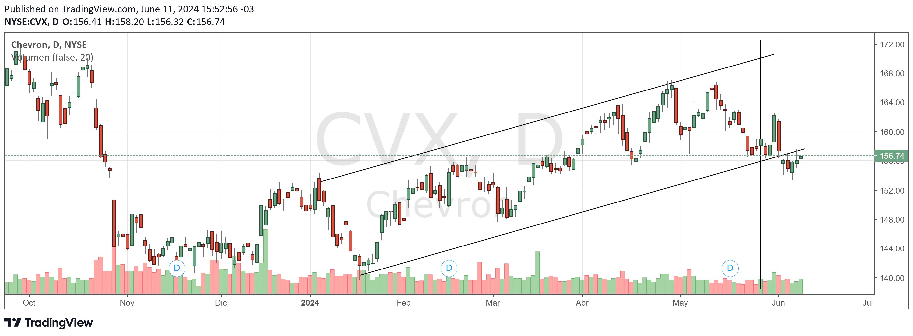
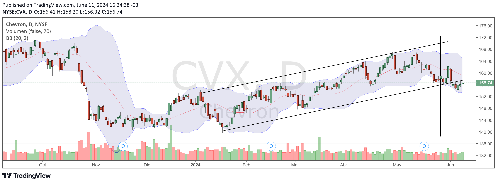

class:inverse, middle

background-image: escudo_interior_blanco.png
background-position: 95% 95%
background-size: 20%

<style>
div.remark-slide-content {
  padding: 1em; /*default is 1em 4em*/
}
.dataTables_wrapper {
  font-size: .5em;
}
</style>

####  15 de junio de 2024

# Instrumentos de renta fija y variable

<br>
<br>

## Presentación cartera de inversión

<br>
<br>
<br>
<br>
<br>
<br>
<br>
<br>


```{r setup, include=FALSE}
knitr::opts_chunk$set( fig.width=9, fig.height=3.5, fig.retina=3,
  out.width = "100%",
  cache = FALSE,
  echo = F,
  message = FALSE, 
  warning = FALSE,
  fig.show = TRUE,
  hiline = TRUE)
options(scipen = 999)
```


```{r, echo=FALSE}
library(xaringanExtra)
library(ghibli)
# BARRA DE PROGRESO DE PRESENTACION
xaringanExtra::use_progress_bar(color = ghibli::ghibli_palette(2)[2])
# LAPIZ 
xaringanExtra::use_scribble()
# EXPLORADOR DE SLIDES
xaringanExtra::use_tile_view()
# HABILITAR WEBCAM
xaringanExtra::use_webcam()
```


```{r theme, include=FALSE, warning=FALSE, eval=TRUE}
library(xaringanthemer) #EVAL FALSE
library(lubridate)
library(tidyverse)
style_mono_light(outfile = "presentacion_theme.css", # CSS FILE
                 # FONTS
                  header_font_google = google_font('Encode Sans'),
                  text_font_google   = google_font('Roboto'),
                  code_font_google   = google_font('IBM Plex Mono'),
                 # COLORES
                 base_color = ghibli::ghibli_palette(2)[2],
                 code_inline_color = ghibli::ghibli_palette(2)[2],
                 inverse_link_color = ghibli::ghibli_palette(2)[2],
                 background_color = "#FFFFFF",
                 title_slide_background_image = "escudo_interior_blanco.png",
                 title_slide_background_position = "95% 5%",
                 title_slide_background_size = "200px", footnote_color = ghibli::ghibli_palette(2)[3], link_color = ghibli::ghibli_palette(2)[2],text_slide_number_font_size = "16px"

                 )
```


---

# Composición de la cartera al inicio

-   INCT.BA: Intel Corporation (CEDEAR)
-   CVX.BA: Chevron Corporation (CEDEAR)
-   GD35: Bonos Rep. Arg. U$S Step Up V.09/07/35

```{r}
source('cartera.R')
```


```{r , message=FALSE, warning=FALSE, echo = F, out.height="60%", out.width="60%"}
library(treemapify)
library(ghibli)
df_todos %>% filter(fecha == fecha_compra & ticker != 'MEP') %>% 
  group_by(fecha) %>% 
  mutate(part =100* precio/sum(precio)) %>% 
  ggplot(aes(area=precio,group=ticker,fill=ticker, label=paste0(ticker,"\n",round(part,1),'%')))+
  geom_treemap()+
  ghibli::scale_fill_ghibli_d(name = 'YesterdayLight',direction = -1 )+
  geom_treemap_text( colour = "black", place = "topleft",
                    grow = T, reflow = T, size = 2)+
  theme(legend.position = 'none')
  
```


---

# Decisiones de compra

-   GD35: paridades bonos
-   INCT.BA: Análisis fundamental
-   CVX.BA: Análisis técnico

```{r}
af_semiconductores <- data.frame(
  stringsAsFactors = FALSE,
       check.names = FALSE,
              simbolo = c("NVDA","AVGO","AMD",
                          "QCOM","INTC","media","media podada","ganador",
                          "2da opción"),
               nombre = c("NVIDIA Corp",
                          "Broadcom Inc.","Advanced Micro Devices Inc.","Qualcomm, Inc.",
                          "Intel Corp.",NA,NA,NA,NA),
           Market.cap = c(2785.44,653.04,271.04,
                          236.29,130.97,NA,NA,NA,NA),
                `P/E` = c("65.17","52.23",
                          "244.95","28.45","32.05","84.57","49.81666667","QCOM",
                          "INTC"),
            `Fwd.P/E` = c("31.58","24.32","30.08",
                          "18.68","15.87","24.106","24.36","INTC","QCOM"),
                  PEG = c("1.4","3.46","7.39",
                          "2.52","0.8","3.114","2.46","INTC","NVDA"),
                `P/S` = c("34.92","16.8","11.89",
                          "6.49","2.37","14.494","11.72666667","INTC",
                          "QCOM"),
                `P/B` = c("63.88","9.28","4.83",
                          "9.67","1.24","17.78","7.926666667","INTC","AMD"),
                `P/C` = c(88.6,55.04,44.91,17.06,
                          6.15,42.352,39.00333333,NA,NA),
           EPS.this.Y = c("107%","12.08%",
                          "32.22%","59.11%","6.10%","43%","34%","NVDA","QCOM"),
           EPS.next.Y = c("31.22%","22.39%",
                          "59.11%","13.96%","73.96%","40%","38%","INTC","AMD"),
         EPS.past.5.Y = c("48.41%","2.37%",
                          "10.43%","-","-38.29%",NA,NA,"NVDA","AMD"),
          EPS.next.5Y = c("46.53%","15.10%",
                          "33.16%","11.29%","39.98%",NA,NA,"NVDA","INTC"),
       Sales.past.5.Y = c("46.68%","11.57%",
                          "31.41%","11.93%","-4.59%",NA,NA,"NVDA","AMD")
   )

```

.tiny[
```{r, out.height='60',out.width='60%'}
library(gt)
af_semiconductores %>% 
  DT::datatable()
```
]

---

# Análisis técnico: Chevron


```{r}

```


---

# Indicadores: volatilidad


$$Desvío Estándar = \sqrt{\frac{1}{N} \sum_{i} (Precio_{i}-MediaMóvil_i)^2}$$


```{r}
library(zoo)
df_cvx<- yf_get(tickers = 'CVX',
                           first_date = first_date,
                           last_date = last_date)

df_cvx <- df_cvx %>%
  select(ticker,fecha=ref_date,precio = price_adjusted) 

df_cvx_indicadores <- df_cvx %>% 
   mutate(media_10 = rollmean(precio,k=10,fill=NA,align='right'),
          media_20 = rollmean(precio,k=20,fill=NA,align='right'),
          sd_10 = rollapply(precio,10,sd,fill=NA,align='right'),
          sd_20 = rollapply(precio,10,sd,fill=NA,align='right')) %>% 
  pivot_longer(cols=-c(fecha,ticker),values_to = 'val',names_to='var')
```

```{r}
df_cvx_indicadores %>% 
  filter(fecha >'2024-01-01') %>% 
  filter(var %in% c('precio','media_10','sd_10')) %>% 
   mutate(var = factor(var,levels=c('precio','media_10','sd_10'),labels=c('Precio','Media móvil','Desvío Estándar'))) %>% 
  ggplot(aes(x=fecha,y=val,group=var,color=var))+
  geom_line(size=1)+
  facet_wrap(~var,scales='free_y',ncol=1)+
  scale_color_ghibli_d(name='KikiMedium',direction = -1)+
  geom_vline(xintercept = as.Date('2024-05-28'),color='black')+
  theme_minimal()+
  theme(legend.position = 'none')+
  labs(x='',y='')
```

---

# Indicadores de volatilidad

-   Bandas de Bollinger: 

$$BB = MediaMóvil \pm 2 * Desvío Estándar $$

```{r}

```


-   VENDER!


---


```{r}

cartera <- df_todos %>% 
  filter(ticker != 'MEP') %>% 
  group_by(fecha) %>% 
  summarise(precio = sum(precio)) %>% 
  ungroup() %>% 
  mutate(indice_100 =100* precio/precio[fecha=='2024-05-28'],
          ticker = 'Cartera') 
  
  
df_todos %>%
  bind_rows(cartera) %>% 
  filter(fecha >= fecha_compra & fecha <= '2024-06-05') %>%
  ggplot(aes(fecha,y=indice_100,group=ticker,color=ticker))+
  ggrepel::geom_label_repel(data=df_todos %>% bind_rows(cartera) %>% filter(fecha == '2024-06-05'),aes(label = ticker))+
  geom_line()+
  geom_point()+
  coord_cartesian(clip='off')+
  scale_x_date(breaks = seq.Date(as.Date('2024-05-28'),as.Date(max(df_todos$fecha))+days(3),by="1 day"),
               date_breaks = "1 day",
               date_labels = "%d %b",
               expand=c(0,1))+
  geom_hline(yintercept=100,color='black')+
  scale_color_ghibli_d('MononokeMedium',direction = 1)+
  theme_minimal()+
  theme(legend.position='none')+
  labs(x='',y='',title='Evolución activos',
       subtitle='Índice 28-may = 100')
#ggsave('evolucion.jpg',scale=5)

```


